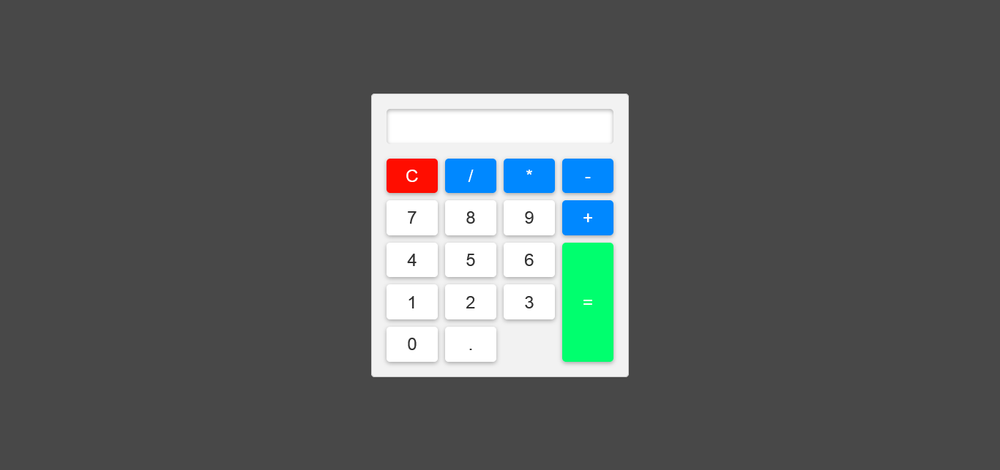

## CALCULATRICE

## Le challenge

Mon but a été de construire une simple calculatrice en HTML5, CSS3 et JavaScript. Les internautes vont pouvoir effectuer des additions, des soustractions, des divisions et multiplications. Le résultat de l'opération effectuée va apparaître dans l'écran de la calculatrice. La remise à zéro s'effectue lors du clic sur le bouton C.

## Démonstration

Lien vers le projet : https://aperbet56.github.io/calculator/

## Développez avec

- Utilisation des balises sémantiques HTML5
- CSS
- Flexbox
- Grid
- Effet / animation au survol sur les touches de la calculatrice
- Page web responsive
- JavaScript
- Code JavaScript commenté
- Desktop first
